Aplicação de Segmentação RFM.
A Aplicação de Segmentação RFM utiliza o Streamlit, pandas matplotlib e seaborn
para classificar clientes em diferentes segmentações baseadas em recência, frequência e valor monetário.
A aplicação possui dados de exemplo pré carregados, só é necessário pressionar o botão processar 
e a segmentação é carregada utilizando o conjunto de dados de exemplo.
Porém também é possível utilizar seus próprios dados para criar uma segmentação.
Para isso é necessário clicar no botão de upload de arquivos, carregar
um arquivo CSV apartir do seu computador e selecionar as colunas necessárias
que são Coluna de Identificação do Cliente, Coluna de Data da Compra e Coluna de Valor.
Após isso a Aplicação exibirá automaticamente gráficos e resumos que podem ser analisados, 
opções de download dos arquivos como CSV e abordagens de marketing recomendadas.
A Aplicação pode ser visualizada em: https://customersegmentation-rfm-roni.streamlit.app/

- Atualização - Analise de Vendas
Arquivo - AnaliseVendas.ipynb
Esse notebook contém uma análise completa de Vendas exibindo Vendas por Mês, Categoria,
Crescimento Percentual, Acúmulo das Vendas, Análise de Cancelamentos entre outros.

As imagens podem ser vistas através das figuras e podem não estar perfeitas, 
isso porque a biblioteca plotly usa JavaScript 
e por isso não renderiza muito bem no GitHub.
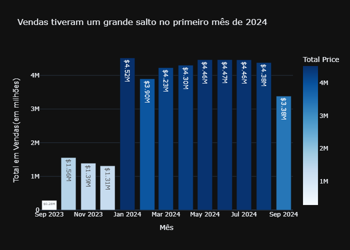
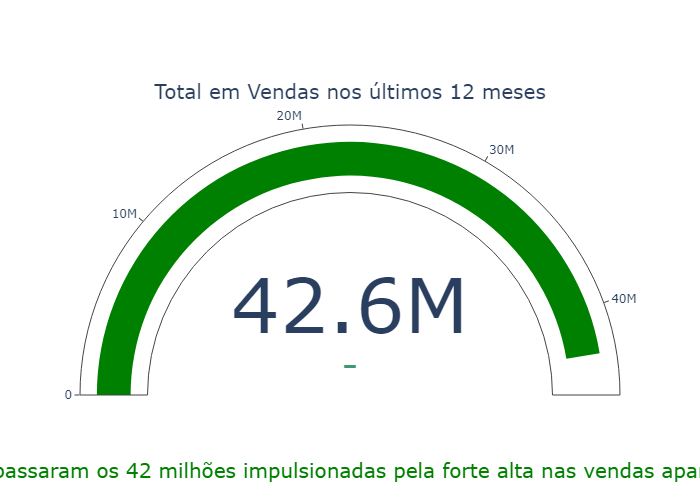
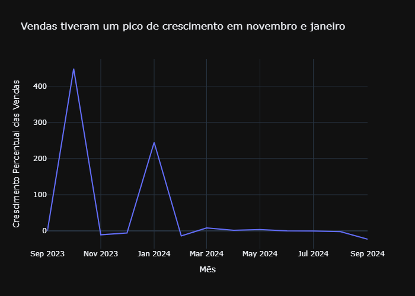
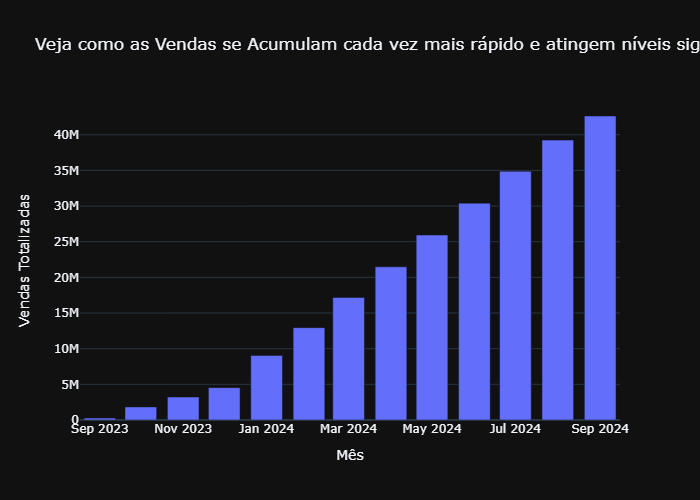
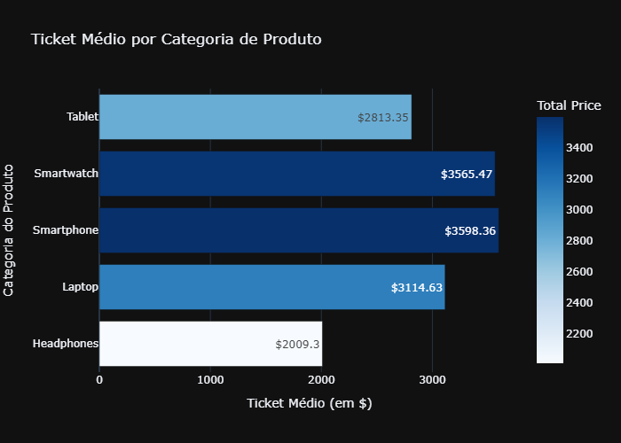
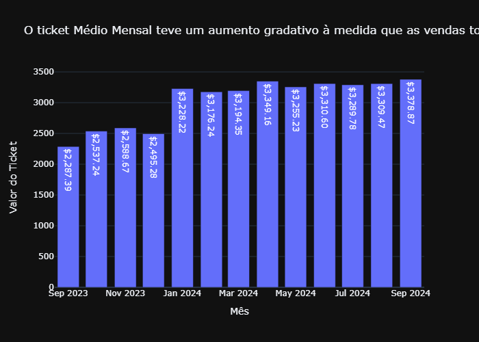
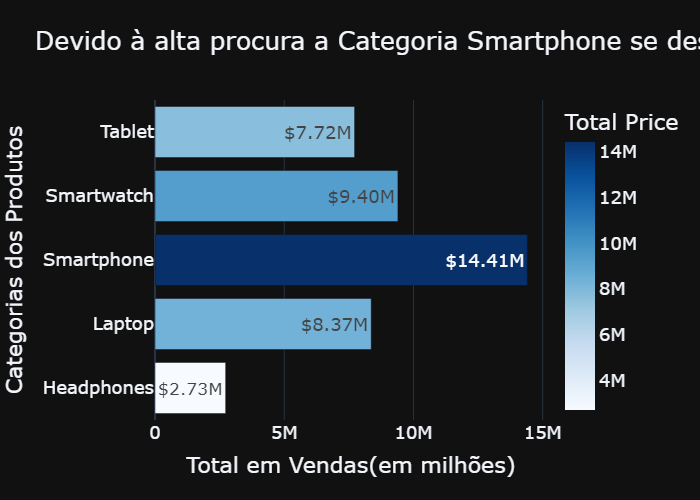
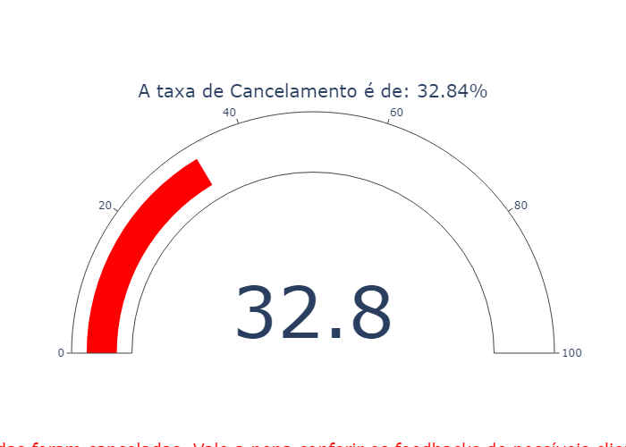
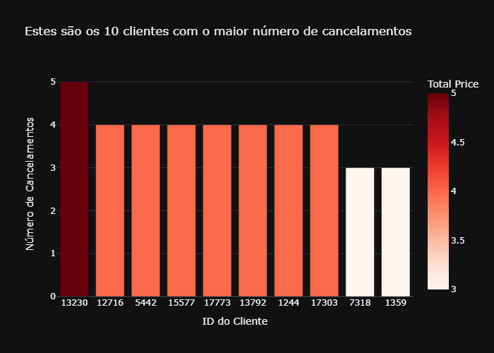
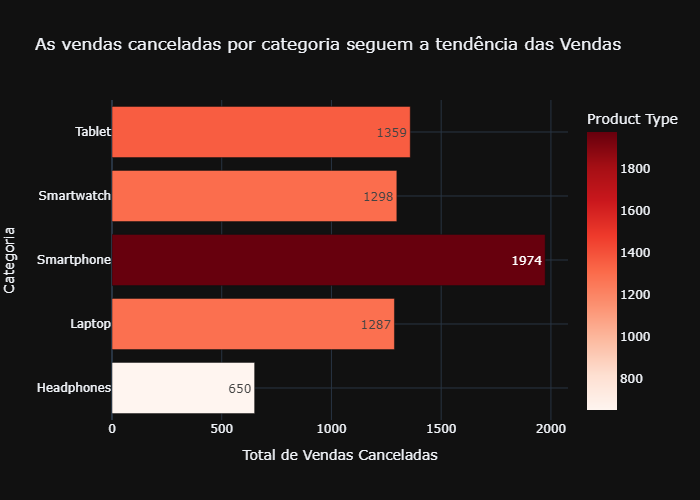
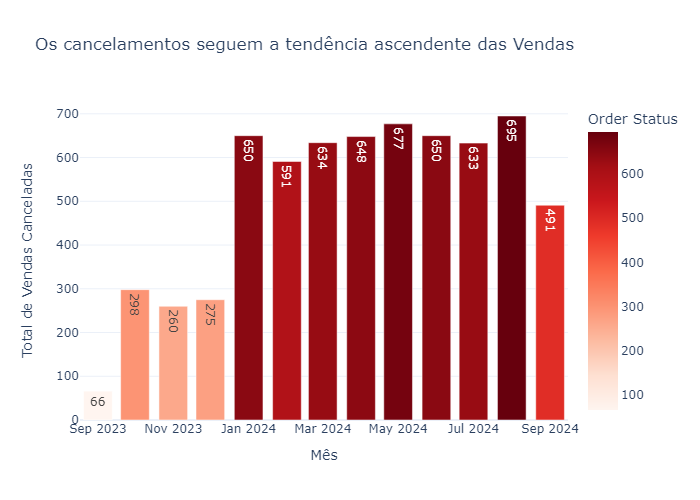
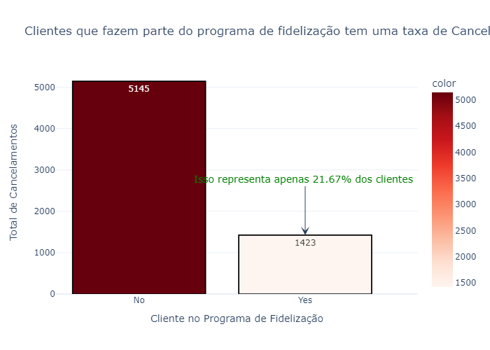